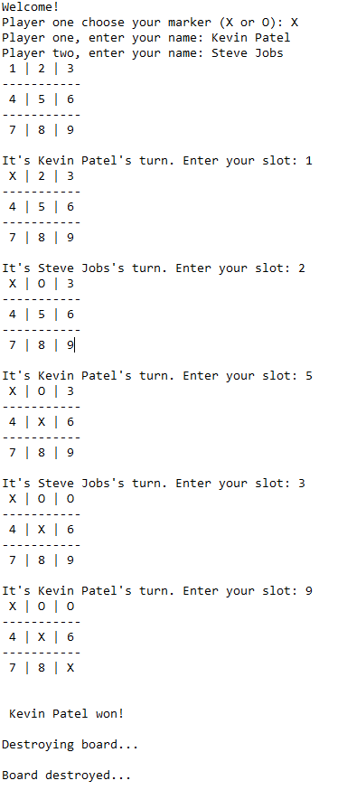

## Program Description 

This program is the third version of the iterative c++ tic tac toe board game. 
In this program, we have implemented the following changes and use cases: 

* Users can assign themselves user names. To achieve this we use dynamic memory that is 
sustained throughout the program until the game ends. 
* Renamed updatePlayerTurn() function to updateMove() to more precisely describe the function 
name for what the function is doing. 

## Upcoming Features / Use Cases 
* Use C++ object oriented programming for classifying in-game objects. 
* Validate user input for the marker. 

## Bug fixes
* The first player now gets recognized for winning. Initially the program was missing the 
condition in which the first player won. 
* The first player was not able to enter their name and the program would directly go to the second player to request for that information. The issue arose from the fact that the initial `cin` function call to assign the first player a marker was not ignoring the newline character after the user input their marker preference. To resolve the issue we call the `cin.ignore()` function which ignores the newline character, this allowed the first player to enter their name when using the `cin` function again.  

## Sample Output  

## Program Deployment 
If you enjoyed learning about this program feel free to give it a go 
by copying the `main.cpp` file and running it on the [online c++ gdb compiler](https://www.onlinegdb.com/online_c++_compiler)

   

